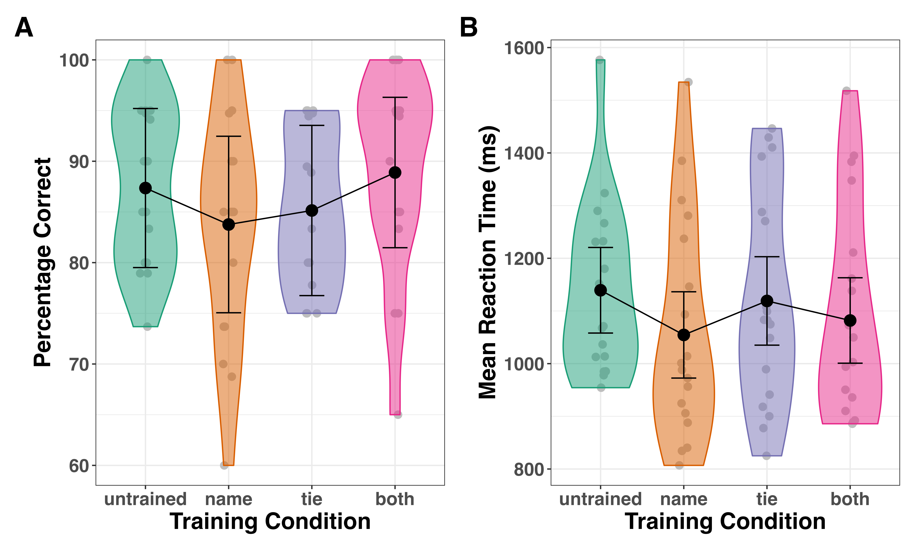
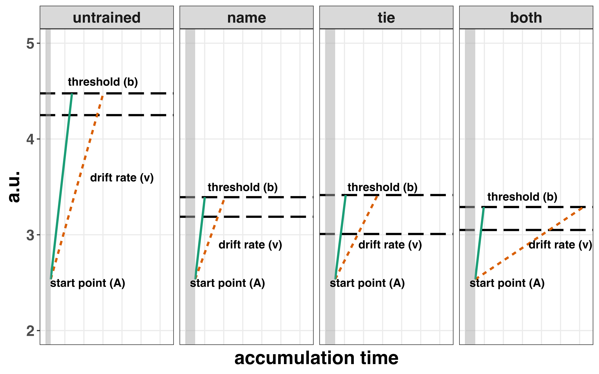

```{r, include=FALSE}
## just include when de-bugging tinytex
# options(tinytex.verbose = TRUE)
```

```{r setup, include = FALSE}
pkg <- c("papaja", "citr", "tidyverse", "RColorBrewer", "patchwork")

lapply(pkg, library, character.only = TRUE)

r_refs(file = "r-references.bib")
my_r_citation <- cite_r(file = "r-references.bib")
```

```{r analysis-preferences}
# Seed for random number generation
set.seed(42)
knitr::opts_chunk$set(cache.extra = knitr::rand_seed)
```

```{r plot-settings}
## theme settings for ggplot
theme_set(
  theme_bw() +
    theme(text = element_text(size = 18, face = "bold"), 
          title = element_text(size = 18, face = "bold"),
          legend.position = "bottom")
)

## Set the amount of dodge in figures
pd <- position_dodge(0.7)
pd2 <- position_dodge(1)
```

```{r global-chunk-settings}
## set the figure options
knitr::opts_chunk$set(fig.pos='H', out.extra = '', out.height = "67%",
                      fig.align = "center") # initial version
```

# Introduction

Evidence accumulation models are a class of computational models used to understand the latent cognitive processes that underlie human decision making. Typically, these models use accuracy and reaction times collected in speeded choice tasks to draw insights about the psychological mechanisms that underlie those decisions. The application of this modelling approach within the domain of cognitive psychology has led to a number of novel insights about the mechanisms that underlie processes such as lexical decision making [@wagenmakers2008], ageing [@ratcliff2001; @ratcliff2010] and perceptual discrimination [@ratcliff2008]. Importantly, these insights are often not evident from more conventional analyses of accuracy and reaction time data. Given these characteristics, we applied an evidence accumulation model, the Linear Ballistic Accumulator (LBA; @brown2008), to behavioural data from a prior published study that used neuroimaging to examine the effects of different types of training on object knowledge and perception [@cross2012d]. In contrast to the original study’s analysis, which analysed accuracy and reaction time separately, in this paper we apply an evidence accumulation model to uncover novel insights into the latent computational processes that underlie linguistic and action-based learning.

Whilst it is common for researchers to draw conclusions from a separate analysis of accuracy and reaction time, it is unclear how to combine these measures into a single measure by which to quantify task difficulty or subject ability [@wagenmakers2007]. Consider, for example, a perceptual discrimination task that requires participants to indicate whether two images are of the same or different objects [@cross2012d; @weisberg2007]. Objects could belong to two categories of training, one where the participants learn to name the object (name-based) and the other where the participant interacts physically with the object (action-based). Objects that are subject to name-based training are discriminated faster but with more errors, than objects that are the subject of action-based training. It is unclear from a separate analysis of accuracy and reaction time data in which condition performance is superior. This is because without a principled way to combine accuracy and RT, these measures are incommensurable. While this example demonstrates the well-documented speed-accuracy trade-off, where less cautious responding is associated with faster, but more error prone responding, and more cautious responding is associated with slower but more accurate responses, this is just one of the many ways in which accuracy and reaction times can interact [@ratcliff1998].

Evidence accumulation models provide a principled way to combine accuracy and reaction time, enabling direct insight into the processes that underlie speeded decisions [@brown2008; @ratcliff2002]. They do so by combining accuracy and the distribution of RT for correct and error responses in order to estimate parameters of a model that can separate the effects of response caution from difficulty. While there are many different varieties of evidence accumulation model, they all share a similar basic framework [@donkin2009]. Namely, these models all assume that when making a decision, evidence is sampled from the environment and that information is used as evidence for one of the potential responses. As soon as evidence in favour of a particular response reaches a threshold, the decision process is terminated and the corresponding response is made.

All evidence accumulation models aim to provide estimates of four common aspects of the decision making process: the rate at which evidence accumulates in favour of a decision (drift rate), how much evidence is required before a response is reached (threshold), the amount of evidence in favour of a response that exists at the outset of a decision (start point noise) and the amount of time it takes to complete all processes that are thought to fall outside the decision, including stimulus encoding and motor responding (non-decision time). These parameters quantify the latent variables of the decision-making process. Threshold, for example, measures the amount of evidence necessary to make a response. As threshold increases, responses take longer but are more likely to be correct. In this way, threshold can account for differences in response caution. Drift rate, on the other hand, is thought to reflect the signal-to-noise ratio of the stimulus. In this way, drift rate quantifies the deterministic component of the accumulation process. Drift rate, therefore, measures both the quantity and the quality of information in the system and can provide a direct measure of task difficult or subject ability [@lewandowsky2018].

Assessing how parameters vary as a function of experimental conditions has the potential to reveal more about the mechanisms that underlie the decision-making process than is apparent from an analysis of accuracy and RT alone [@dutilh2019; @donkin2009; @evans2019; @evans2020]. Perhaps one of the most persuasive examples of this approach comes from the ageing literature. One typical finding within the ageing research is that response times increase with increasing age, a finding that led to the conclusion that there is a cognitive decline associated with ageing [@salthouse1996]. Application of an evidence accumulation model to data from such tasks, however, reveals that rather than older adults performing more poorly on speeded response time tasks than younger adults, differences in responses are actually due to differences in response caution [@ratcliff2004]. That is, older adults are more cautious responders than younger adults, requiring a higher level of evidence to trigger a response. Importantly, this inference was not available from a traditional analysis of accuracy and RT. This is just one example in which evidence accumulation modelling has allowed researchers to draw inferences that were unavailable in a traditional analysis of behavioural data [@white2022]. Evidence accumulation modelling thus provides us with an opportunity to interrogate behavioural data to uncover novel insights into the latent variables that underlie decision making in a way that a traditional analysis cannot.

In the present paper, we use the evidence accumulation approach to shed new light on the mechanisms that underlie two kinds of learning based on different types of training experience. Specifically, we apply the Linear Ballistic Accumulator (LBA) (Brown & Heathcote, 2008) to behavioural data from an existing multi-session training dataset that taught participants how to tie and name novel knots (Cross et al., 2012). In making use of existing data not only do we provide novel insights into the mechanisms that underlie different types of training, but we also demonstrate how computational modelling can lead to conclusions that are not readily apparent from a traditional analysis of accuracy and RT alone.

In the domain of training, the most typical behavioural finding is that with increased repetition of a task response times decrease and accuracy increases [@simons2016; @vonbastian2022]. While this finding is most commonly interpreted as evidence of improved task performance, it provides few insights about the latent processes that underlie training-related changes. Evidence accumulation modelling of training effects, on the other hand, has shown that task repetition can influence the rate at which information accumulates, the amount of evidence needed to trigger a response and non-decision time [@dutilh2009; @dutilh2011; @reinhartz2023]. Studies that have used these computational modelling techniques to investigate how task repetition improves response times report an increase in the rate of information accumulation associated with repeated performance of the same speeded task [@dutilh2009; @dutilh2011; @liu2012; @ratcliff2006; @zhang2014].

These studies have also found that while the rate of information accumulation increases during practice, these effects are also associated with decreased boundary separation (Dutilh et al., 2011; Dutilh et al., 2009; Liu & Watanabe, 2012; Zhang & Rowe, 2014). That is, with increased repetition of a task, participants require less evidence to trigger a decision. This finding has led some authors to suggest that training effects may elicit a shift in response caution, leading people to prioritise speed over accuracy. The influence of training on non-decision time has less consistently been reported in the literature, with some studies suggesting that training decreases non-decision timing (Dutilh et al., 2011; Dutilh et al., 2009) and other studies reporting no influence on this parameter [@strobach2013]. Dutilh and colleagues (2011; 2009), for example, found that improved performance on a repeated lexical decision task was associated with faster drift rates, lower response caution and a decrease in non-decision time. This finding led the authors to conclude that training effects were multifaceted.

These conclusions, however, have been drawn from a limited number of perceptual discrimination tasks, with the vast majority of studies using either random dot motion [@cochrane2023] or lexical discrimination tasks (Dutilh et al., 2011). Similarly, these studies typically investigate training related changes that are induced by task repetition (Dutilh et al., 2011; Dutilh et al., 2009). In contrast, we applied evidence accumulation modelling to understand and compare the mechanisms that underlie different types of training during a complex real-word perceptual discrimination task.

Cross and colleagues (2012), across five days, taught knot-naïve participants to tie or name a set of knots that were previously unknown to them. Performance on, and neural activity during, a perceptual discrimination task was then measured. Participants were required to discriminate whether two images were of the same or different knots. Stimuli fell into one of four training categories; training about how to name and tie the knot, knowledge of how to name the knot only (linguistic-based training), training in how to tie the know only (action-based training) and no training of the knot. Consistent with typical training effects the authors reported a decrease in response times as training days progressed. A somewhat surprising effect of training type on response times also emerged, with participants performing the perceptual discrimination task faster for untrained compared to trained knots. There were no effects of training in terms of accuracy data. The authors concluded that these behavioural findings were suggestive that the newly formed linguistic and action knowledge that was developed via training was taking time to process when presented with a familiar set of knots. This conclusion, however, is based upon a traditional analysis of observed variables where reaction times reflect the total time taken to complete the decision-making process, including stimulus processing and motor responding. Application of evidence accumulation modelling, on the other hand, provides us with an opportunity to break down a decision into the latent variables that underlie the acquisition of linguistic and action-based knowledge induced by training.

The aim of the present study was to investigate to what extent parameters in the LBA model vary by each type of training. Given previous studies have suggested that increased drift rate, decreased response caution and decreased non-decision time (Dutilh et al., 2011; Dutilh et al., 2009; Zhang & Rowe, 2014) are all associated with training-related changes, we hypothesised that improvements in perceptual discrimination due to training would be associated with (1) an increase in drift rate; (2) a decrease in response caution; (3) a decrease in non-decision time or (4) some combination of these factors. Furthermore, it was also possible that the extent to which these parameters varied by training type (naming, tying, naming & tying, untrained) may differ, although we had no specific predictions about the direction of this hypothesis.

# Methods

## Transparency and Openness Statement

We report how we determined our sample size, all data exclusions (if any), all manipulations, and all measures in the study [@simmons2012]. In addition, the hypotheses and planned analysis for this paper were preregistered in advance (see our pre-registration here: [https://aspredicted.org/6ztj-45s5.pdf](https://aspredicted.org/6ztj-45s5.pdf)). We deviated from our pre-registration in one way. Originally, we had intended to include in our model data from both a pre- and post-training session. That is, we intended to compute the difference in parameter estimates between the pre- and post-training variable. Instead, we only included data from the post-training session in our final analysis. This deviation from preregistration was necessary as the model building process could not be completed with both pre- and post-training session variables included, due to the large number of parameters being fit and the model failing to converge. By removing the pre-training session data, the number of parameters was reduced by half. As a result, the model could converge and we were able to successfully complete the model building process.

Importantly, given that we were interested in the mechanisms that underlie training vs. no-training, as well as comparisons between different types of training (linguistic vs. action vs. both), only the post-training session was necessary to capture and quantify these effects. Indeed, Cross and colleagues (2012), in their original study, included only results from the post-training session in their final analysis, as this session is thought to be more consistent and reflect the participants' learned state [@weisberg2007]. All other aspects of the pre-registration were unchanged. In addition, the analysis code used in this paper is available online, and the manuscript was written in R using the papaja() package [@R-papaja], which means it is  computationally reproducible. The code and manuscript are available via GitHub ([https://github.com/rich-ramsey/knot_dmc](https://github.com/rich-ramsey/knot_dmc)).  Given that the data were collected several years before 2012, it was not yet routine to request explicit consent to share data publicly. Therefore, the raw data are only available from the authors upon request. 

## Dataset

We applied the LBA model to a previously published dataset from Cross and colleagues (2012). This study used fMRI to examine brain activity whilst participants completed a speeded perceptual discrimination task before and after training. The data used in the current study, therefore, were collected in or before 2012. Training consisted of participants learning to name 10 knots, tie 10 knots and name and tie a further 10 knots, while a final 10 knots remained untrained (i.e., no information about how to tie the knot or what it was called was experienced during the training period). Before and after the knot training portion of the study, participants were required to complete 80 trials of a perceptual discrimination task. In this task, participants had to decide whether two photographs were of the same or different knots. Each pair of knots was selected from the same learning class (i.e., name, tie, both name and tie or untrained knots). When photographs were of the same knot, the viewing angle of the two photographs differed, so the stimuli presented were never identical. Of the 80 trials, 50% of the knots were the same and 50% of the knots were different. Both accuracy and response times (ms) of the perceptual discrimination task were recorded. As we were interested in modelling only the behavioural results of the perceptual discrimination task, we summarise the aspects of the dataset relevant to the present study below and refer readers to the original paper for all other details (see Cross et al., 2012).

The data included in the present paper differed from that reported by Cross and colleagues (2012) in a number of key ways. First, while 30 participants took part in the behavioural portion of the original study, only data from the 20 participants who comprised the final fMRI sample were available for re-analysis. The decision to include only the final training session in the LBA model meant that a further two participants were excluded from modelling as they did not complete the final session of the perceptual discrimination task. Therefore, 18 participants were included in the present study (M = 19.4 years, age ranged from 17 – 27 years). Second, unlike Cross and colleagues who included the post-training session across all five days in their analysis of accuracy and RT, we included only the post-training session on the final day of training (Day 5 post-training). Given the aim of our study was to use evidence accumulation modelling to examine the cognitive mechanisms underlying linguistic and action-based training, it was sufficient to use the training effects evident on the last day of training for our analysis. That is, general training effects could be compared via a comparison between the untrained and trained conditions, and between each type of training category (e.g. linguistic vs. action vs. both). The benefit of including only the final post-training sessions was a computationally simpler model.

The present study therefore had a single within-subjects factor of training type with four levels (naming/tying/both/untrained). During naming training, participants were shown a video of a knot being rotated through 360 degrees with the name displayed in the top right-hand corner of the screen. During tying training, participants were shown a video of how to tie the knot from a first-person perspective and instructed to correctly tie each of the knots in this category by following along with the video at least once per day of training. During both naming and tying training participants were shown a video of how to tie the knot with the name of the knot displayed in the top right-hand corner of the screen and were instructed to correctly tie each of the knots in this category at least once per day of training. Knots in the untrained condition were unfamiliar to participants. Assignment of each of the 40 knots was counterbalanced across training condition and participant.

## LBA data analysis

### Model Specification

We fit the LBA model to each participants’ data for the final post-training session. The LBA model has one accumulator for each response, each with potentially different parameter values. In this design, that meant that there was one accumulator for pairs of knots that were the same and another accumulator for pairs of knots that were different. Each accumulator possessed the following parameters; start point noise (A), representing the amount of information in each accumulator at the beginning of a decision; threshold (b) which represents the amount of evidence necessary in order to trigger a decision (in the present study this was represented in terms of the difference between the top of the start point distribution and the response threshold ($B = b - A \ge 0$); drift rate (v) the rate at which evidence accumulates for each response; and non-decision time ($Ter \ge 0$) the amount of time it takes to complete all other processes that fall outside the decision making process, including stimulus encoding and motor responding. We allowed the threshold parameter to vary by Training Type (name, tie, both, untrained) and Response (participant’s response as to whether the two knots match vs. no-match). The drift rate parameter was allowed to vary by Training Type and an accumulator match factor, which denotes the match between the accumulator and the stimulus. Specifically, if the stimulus displayed two of the same knots, then the accumulator for the “match” response was the TRUE or matching accumulator, whereas the accumulator for the “no match” response would be the FALSE or mismatching accumulator. In this way the difference between the TRUE and FALSE accumulator captures both the quantity and quality of information accumulating about the stimulus. The larger the difference between the TRUE and FALSE accumulators, the higher the quality of information accumulating in favour of that response (Lewandowsky & Oberauer, 2018). Given this, we operationalised drift rate as the difference between the TRUE and FALSE accumulator. The standard deviation for the TRUE accumulator was allowed to vary by the accumulator match factor, whereas the standard deviation for the FALSE accumulator was fixed at 1 to make the model identifiable (Donkin et al., 2009). The non-decision time parameter was allowed to vary by Training Type, while the standard deviation of non-decision time was fixed at 0. We fixed a single value for start point noise (A).

### Model estimation

Model estimation was carried out in a Bayesian statistical framework using the Dynamic Models of Choice software that is written in the R programming language [@heathcote2019]. Full details of priors and sampling methods are provided in supplementary materials. Following prior work [@castro2019], priors were selected using a weakly informative approach. That is, priors were chosen to have little influence on estimation (graphical summaries of how posteriors were updated relative to priors are provided in supplementary materials). Sampling occurred in two steps. First, sampling was carried out separately for each individual participant. The results of this step then provided the starting points for the full hierarchical model. Inspection of graphical summaries confirmed that the model provided an adequate account for all major aspects of the data. Cumulative distribution functions comparing data with the model are provided in supplementary materials.

### Parameter Estimates

In order to make inferences about the mechanisms that underlie different types of training, we compared the influence of training type in the final post-training session across different parameter estimates. Specifically, the threshold, drift rate difference and non-decision time parameters were estimated for each training type (untrained, naming, tying, both). Each posterior sample for each individual participant was then averaged across individuals to obtain the distribution of group average differences for each parameter. Pairwise comparisons on these posterior distributions were then computed between each training type and the untrained condition, as well as between each training type. To summarise the distribution of parameters of interest we report the median of the posterior distribution together with 95% quantile intervals of the distribution in square brackets.

# Results

## Analysis of Observed Variables

Prior to conducting evidence accumulation modelling, we first analysed accuracy and reaction time separately. The purpose of this analysis was primarily to assess the effect of training as in the original paper (Cross et al., 2012). In particular, given that the data included in our analysis differed in a number of ways to that reported by Cross and colleagues, we sought to estimate the size of training effects evident in a separate analysis of accuracy and RT. These analyses were conducted using a Bayesian estimation approach to multilevel modelling. As these analyses were not the main focus of this paper, we report them briefly below. Full details, however, can be found in supplementary materials.

There was some evidence of an effect of training type on accuracy (see Figure 1A). Relative to the untrained condition (M = 87.4, SD = 33.3) accuracy was higher for knots that received both naming and tying training (M = 88.9, SD = 31.5), but was lower in both the tying (M = 85.1, SD = 35.6) and naming conditions (M = 83.8, SD = 36.9). There also appeared to be an effect of training type in RT (see Figure 1B) relative to knots that received no training (M = 1139 ms, SD = 345 ms), participants responded faster to knots that received naming training (M = 1055 ms, SD = 347 ms), tying training (M = 1119 ms, SD = 356 ms) and knots that received both naming and tying training tying training (M = 1082 ms, SD = 344 ms).

(ref:accuracy-rt-caption) Accuracy and Reaction Time by Training Type and Session. (A) Percent correct on the perceptual discrimination task by training type. (B) Mean reaction time (ms) on the perceptual discrimination task by training type. Black points denote group means, while error bars represent within subjects’ standard errors of the mean. Grey points denote individual subject means.

```{r accuracy-rt-plot, fig.cap = "(ref:accuracy-rt-caption)"}

```

## Evidence Accumulation Modelling

### Thresholds

Inspection of the posterior distributions for the threshold parameter of the LBA model revealed evidence to suggest that thresholds significantly differed by Training Type. Specifically, thresholds were lower in all three training conditions, naming (0.76 [0.64, 0.88]), tying, (0.68 [0.57, 0.79]) and both naming and tying training (1.01 [0.84, 1.19]) relative to the untrained condition (2.80 [2.60, 3.03]) (see Figure 2A).

Pairwise comparisons between each training condition and the untrained condition confirmed that there was a substantial reduction in thresholds in all three trained conditions compared to the untrained condition (see top row of Figure 2B). In contrast, pairwise comparisons between each type of training revealed little evidence to suggest that thresholds differed substantially by type of training (see bottom row of Figure 2B). Therefore, these results suggest that participants were substantially less cautious when responding to all trained knots compared to untrained knots.

(ref:threshold-caption) Posterior Distributions for the Threshold Parameter by Training Condition and Pairwise Differences between Training Conditions. (A) This panel demonstrates the posterior distributions for the threshold parameter of the LBA model by training condition. (B) This panels shows the difference in the posterior distribution for the threshold parameter between each training condition relative to the untrained condition (top row) and between each training condition (bottom row). In all graphs, black points represent the median value of the posterior distribution, while thick black lines represent the 95% quantile interval of the distribution. In difference graphs, the red line represents the zero point of the distribution.

```{r threshold-plot, fig.cap = "(ref:threshold-caption)"}
knitr::include_graphics("../figures/ea/thresholds.jpeg")
```

### Drift rate

In order to quantify the influence of training type on the quality and quantity of information accumulating from the stimulus, we computed the difference between the TRUE and FALSE drift rate (drift rate difference). As can be seen in Figure 3A drift rate difference appeared substantially higher for knots that received both tying and naming training (3.12 [2.74, 3.53]), relative to naming (2.30 [2.01, 2.60]), tying (2.39 [2.13, 2.67]) and untrained conditions (2.08 [1.85, 2.31]). Pairwise comparisons between training conditions confirmed that there was evidence to suggest that the quality of evidence accruing was higher for knots that received both naming and tying training relative to knots that received naming, tying and no training (See Figure 3B). The posterior distributions for each of these comparisons was positive and with values entirely above zero.

As can be seen in Figure 3B there was also evidence that the drift rate difference was greater for knots that received naming training relative to no training and tying training relative to no training, respectively. The posterior distributions for each of these comparisons was largely positive, with most values falling above zero. In contrast, there was no evidence to suggest that drift rate differed between the naming and tying conditions (bottom right-hand graph in Figure 3B), with the difference centred around zero, with values falling both above and below zero.

(ref:drift-rate-caption) Posterior Distributions for the Drift Rate Difference Parameter by Training Condition and Pairwise Differences between Training Conditions. (A) This panel demonstrates the posterior distributions for the drift-rate parameter of the LBA model by training condition. (B) This panels shows the difference in the posterior distribution for the drift-rate parameter between each training condition relative to the untrained condition (top row) and between each training condition (bottom row). In all graphs, black points represent the median value of the posterior distribution, while thick black lines represent the 95% quantile interval of the distribution. In difference graphs, the red line represents the zero point of the distribution.

```{r drift-rate-plot, fig.cap = "(ref:drift-rate-caption)"}
knitr::include_graphics("../figures/ea/drift_rate.jpeg")
```

In summary, a clear benefit emerged in terms of the quality and quantity of information processing during task performance following training that jointly involved both types of learning (naming and typing). A smaller benefit was observed for information processing when only one type of training was provided (naming or tying). In other words, all types of training, albeit to different degrees, made the drift-rate parameter associated with the accurate response steeper than the incorrect response. All things being equal, the benefit of such drift-rate effects to performance would be faster and more accurate responses.

### Non-decision time

As Figure 4 demonstrates, relative to the untrained condition (0.26 [0.22, 0.29]) non-decision time was significantly higher for knots that received naming (0.50 [0.47, 0.53]), tying (0.51 [0.48, 0.54]) and both naming and tying training (0.52 [0.50, 0.55]).

Pairwise comparisons showed that non-decision time was substantially higher in all three training conditions relative to the untrained condition with difference values being positive and entirely above zero. In contrast, pairwise comparison revealed there to be no evidence to suggest that non-decision time differed by training type, with difference values centered around zero (see Figure 4B).

Given that motor preparation for such a simple key-pressing task is unlikely to be affected by this type of training, we suggest that these results must reflect the longer time taken to encode the stimulus following the development of newly acquired linguistic or action knowledge.

(ref:ndt-caption) Posterior Distributions for the Non-decision Time (ndt) Parameter by Training Condition and Pairwise Differences between Training Conditions. (A) This panel demonstrates the posterior distributions for the ndt parameter of the LBA model by training condition. (B) This panels shows the difference in the posterior distribution for the ndt parameter between each training condition relative to the untrained condition (top row) and between each training condition (bottom row). In all graphs, black points represent the median value of the posterior distribution, while thick black lines represent the 95% quantile interval of the distribution. In difference graphs, the red line represents the zero point of the distribution.

```{r ndt-plot, fig.cap = "(ref:ndt-caption)"}
knitr::include_graphics("../figures/ea/ndt.jpeg")
```

### Summary

To help visualise the pattern of results across conditions, in Figure 5 we plot the mean values of each parameter and each condition using the structure of a decision model plot. This plot does not form part of our inferential analytical approach. Instead, the plot provides a visual aid to highlight differences between conditions, as well as how the parameters may combine together within one particular condition. For example, we think that the plot nicely illustrates the differences between conditions in non-decision time (grey rectangle), thresholds (dashed black lines) and drift rate (solid green and dashed orange lines).

(ref:lba-summary-caption) A summary of the key findings visualised using the structure of a decision model plot. Each panel represents an experimental condtion and displays the same information. The grey column represents non-decision time (ndt) with its thickness representing the amount of ndt. Start point (A) was fixed across conditions and does not vary. For ease of presentation, two thresholds (b, dashed black lines) are displayed per condition. The lower threshold represents a mismatch between the displayed knots and the higher threshold represents a match between the displayed knots on a given trial. The mean drift rate (v) for true (solid green) and false (dashed orange) responses are also displayed.

```{r lba-summary-plot, fig.cap = "(ref:lba-summary-caption)"}

```


# Discussion

The aim of the present study was to use evidence accumulation modelling to investigate the cognitive mechanisms that underlie linguistic and action-based training in a simple knot-tying and knot-naming task. Our results revealed that the effects of training are multifaceted, in terms of the latent cognitive processes involved. In other words, training impacted several cognitive sub-processes that, in combination, determine subsequent task performance. In addition, an added benefit was observed for the speed of information accumulation when naming and tying experience were combined. This latter finding suggests that a multi-modal training protocol can aid the quantity and quality of information processing during decision making. Below, we discuss several ways in which our findings advance our understanding of how cognitive systems are shaped by different types of knowledge acquisition and experience. More generally, we also outline why future work may benefit from taking a more computational approach to understand the effects of training on learning and performance.

## Training leads to general decreases in response caution and general increases in non-decision time

As predicted, our results showed that relative to the untrained condition, response caution was lower in all of the training conditions. That is, participants required less evidence to trigger a decision in the perceptual discrimination task when presented with any of the trained knots compared to untrained knots. This finding is in consistent with other studies that have found task repetition to be associated with decreased response caution (Dutilh et al., 2011; Dutilh et al., 2009; Liu & Watanabe, 2012; Zhang & Rowe, 2014). Extending these previous studies, our results also suggest that this decrease in response caution is a general effect and does not differ by type of training. Specifically, we found no evidence to suggest that changes in response caution differed whether knots received naming or tying training, or a combination of both. Given that lower response caution signals a tendency to prioritise the speed over the accuracy of responses, these results suggest that training, in part, provides a general bias to favour quicker responses.

The effects of training on non-decision time were consistent with the behavioural findings reported in the original study (Cross et al., 2012). Specifically, the original authors found reaction times to be higher in all three training conditions relative to the untrained condition. In the current study, we found all types of training to be associated with an increase in non-decision time. That is, participants took approximately twice as long to complete all other mechanisms that fall outside the decision-making process, such as stimulus encoding and motor responding, when presented with a trained compared to an untrained knot. We found no evidence to suggest that the non-decision time parameter was modulated by training type. When these results are taken on their own, and given that motor preparation for such a simple key-pressing task is unlikely to be affected by this type of training, we infer that these results reflect the longer time taken to encode the stimulus following the development of newly acquired linguistic or action knowledge. In other words, we consider these effects to reflect the added cognitive processes that are triggered by viewing a stimulus that has been in some way enriched by training experience.

As a point of comparison, however, it is noteworthy that other training studies have either failed to find an association between training and non-decision time (Strobach et al., 2013) or they have reported training to decrease non-decision time (Dutilh et al., 2011; Dutilh et al., 2009). These prior studies used largely different forms of training to the current study. For example, Dutilh and colleagues (2009) trained participants on a lexical decision task. The lexical task involved making a word vs non-word judgment to strings of text and training involved repeatedly performing the same task across several days. Therefore, it is currently unclear how different types of training and experience may impact non-decision time, but it seems a valuable component to include when building models of the computational processes involved in experience-dependent plasticity.

## The combination of linguistic and action-based training increases the quality of information accumulation

We found evidence to support the hypothesis that training increases the rate at which evidence accumulates. Relative to knots that were untrained, there was an increase in the rate at which evidence accumulated following all training conditions (naming, tying and both). The finding that training generally increases the rate at which evidence accumulates is consistent with previous studies that have found repeatedly completing speeded tasks to be associated with an increase in the rate at which information accumulates (Dutilh et al., 2011; Dutilh et al., 2009; Liu & Watanabe, 2012; Ratcliff et al., 2006; Zhang & Rowe, 2014). Thus, de novo acquisition of linguistic and action knowledge made it easier to quickly and accurately arrive at a perceptual judgment.

In an extension of these studies, however, the increase in drift rate was substantially higher for knots that received both naming and tying training, compared to untrained knots and knots that received either type of training alone. A such, the ability to reach a decision quickly and correctly was made easier by a training regime that combined two types of training knowledge. We consider two ways to interpret the added benefit of multi-modal training. First, it is possible that the increase in drift-rate represents a dose-response effect, rather than being due to the unique combination of two types of training. That is, knots that received both training types received more training overall than knots that received only naming training or only tying training. Even so, it is still noteworthy that such a dose-response effect was specific to the drift-rate parameter and not evident in either the threshold or non-decision time parameter.

A second interpretation is that the unique combination of linguistic and action-based training may somehow enhance the quality and quantity of information accumulation during decision making. Such a qualitative interpretation would be consistent with prior studies that have reported multi-modal training protocols to lead to greater improvements in cognitive functions such as visuospatial working and episodic memory, executive functioning and the speed of information processing than single-function training protocols, as well as studies that report multi-model training protocols to engage a broad network of sensorimotor brain regions more than unimodal training protocols [@kirschAdditiveRoutesAction2015]. In the present study, we were unable to tease apart whether the results reflect a dose-response effect or instead reflect a qualitatively different impact of multi-modal training. We encourage future studies to systematically manipulate the combination of training types to determine whether increased exposure to training and/or different types of training influence the quality and rate at which evidence accumulates about a decision.

## Implications for understanding the effects of training and experience

The results of this study have a number of implications for our understanding of how training influences cognitive processes during a perceptual decision making. First, on a more general level, our key inferences about the mechanisms that underlie training would not be possible from a more conventional and separate analysis of accuracy and RT [@parker2023a]. The results of the present study, therefore, make it clear that the application of evidence accumulation modelling to behavioural data from a previously published training paradigm or a future training study can uncover new insights about the cognitive mechanisms responsible for learning and the acquisition of object knowledge.

Second, consistent with prior studies, our results revealed training effects to be multifaceted. That is, training effects were evident across a number of parameters of the LBA model, rather than a single parameter (Dutilh et al., 2011; Dutilh et al., 2009; Reinhartz et al., 2023). This suggests that improvements in task performance that are associated with training can be attributed to a number of underlying mechanisms. It may also be one reason for the wide variety of training-induced outcomes that are observed across different tasks and training protocols, as it is possible that different types and amounts of training can impact underlying cognitive processes in different ways. And this is one clear benefit to understanding cognitive processes that is provided by taking a more mathematical approach to theory building in psychology and cognitive neuroscience, as it forces a more explicit formulation of the relationship between parts of a system that are under investigation [@hintzman1991; @yarkoni2022].

Third, in an extension to previous studies, which typically administer one type of training (Dutilh et al., 2011; Dutilh et al., 2009; Reinhartz et al., 2023), we found no evidence to suggest that training effects differ by training type (linguistic: learning names vs. motor: learning to tie). This finding is noteworthy to consider in the context of the neuroimaging results of the original study, which found action-based training to be uniquely associated with activation in the anterior intraparietal sulcus, a brain region associated with object manipulation (Cross et al., 2012). On the face of it, therefore, these results suggest that are some unique training-specific contributions that shape cognitive and brain-based mechanisms, but our analytical approach was insensitive to such training-type differences. Taken together, these results highlight the value of using multi-method approaches to tackle research questions in cognitive neuroscience, as we are able to provide empirical support for domain-general as well as domain-specific effects of training.

## Limitations and constraints on generality

While we modelled behavioural data collected from one perceptual discrimination task completed on the final day of training, it is possible that there were session-by-session and trial-by-trial training effects that were not captured in the present study. In a recent application of evidence accumulation modelling to trial-by-trial data from a learning study, for example, the authors reported that training effects were best characterised as a continuous changing in drift rate, and a day-by-day variability in response caution (Cochrane et al., 2023). Future studies should, therefore, look to collect enough data per session to enable a computational modelling approach that can examine the time course of learning at both the trial and session level.

It is also important to acknowledge constraints on the generality of our findings [@simons2017]. While we interpret the results of our study as indicative of the mechanisms that underlie training effects broadly, we cannot rule out the possibility that these effects are specific to the type, amount and duration of training used in the original studies training paradigm. Future studies should look to systematically manipulate the type and amount of training participants receive, across a range of tasks in order to further understand the cognitive mechanisms that underlie different forms of training.

\newpage

# References

::: {#refs custom-style="Bibliography"}
:::
