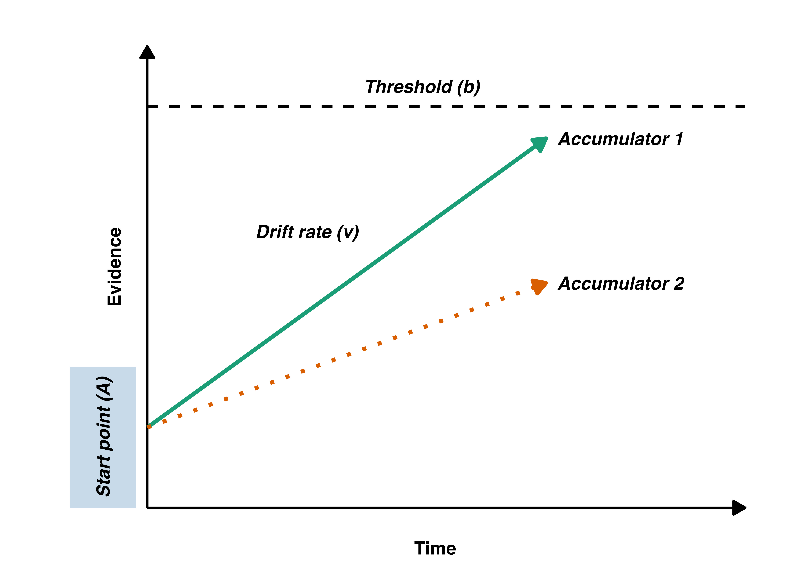
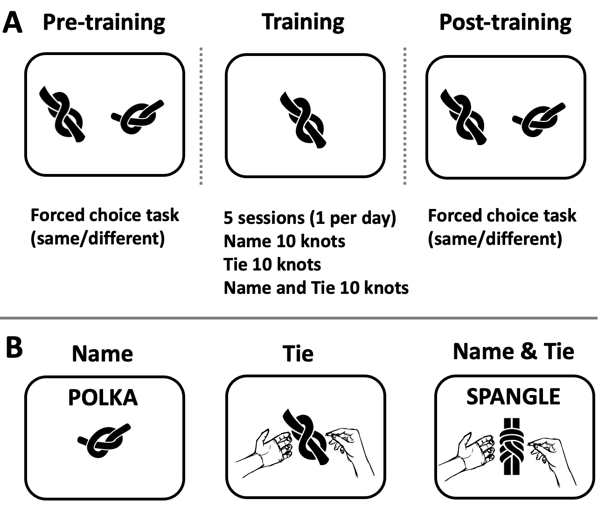

```{r setup, include = FALSE}
## just include when de-bugging tinytex
# options(tinytex.verbose = TRUE)

## load libraries
pkg <- c("papaja", "citr", "tidyverse", "RColorBrewer", "patchwork")

lapply(pkg, library, character.only = TRUE)

## load reference .bib files
r_refs(file = "r-references.bib")
my_r_citation <- cite_r(file = "r-references.bib")

# Seed for random number generation
set.seed(123)
knitr::opts_chunk$set(cache.extra = knitr::rand_seed)

## theme settings for ggplot
theme_set(
  theme_bw() +
    theme(text = element_text(size = 18, face = "bold"), 
          title = element_text(size = 18, face = "bold"),
          legend.position = "bottom")
)

## custom wrangle and plotting functions
source("../custom_functions/wrangle_plot.R")

## set the figure options
# knitr::opts_chunk$set(fig.pos='H', out.extra = '', out.height = "67%",
#                       fig.align = "center") # initial version

knitr::opts_chunk$set(fig.pos='H', out.extra = '', 
                      out.width = "1.0\\textwidth",
                      fig.align = "center")
```

# Introduction

Evidence accumulation models are a class of computational model^[We use the term 'computational model' following standard usage in the cognitive modeling literature (Farrell & Lewandowsky, 2018) to refer to formal mathematical models that specify latent cognitive processes and generate quantitative predictions about behavior.] used to understand the latent cognitive processes that underlie human decision making [@farrell2018]. These models use the speed and accuracy of responses in forced-choice tasks to draw insights about the psychological mechanisms that underlie decision making. The application of this modelling approach within the domain of cognitive psychology has led to a number of novel insights about the mechanisms that underlie processes such as lexical decision making [@wagenmakers2008], ageing [@ratcliff2001; @ratcliff2010] and perceptual discrimination [@ratcliff2008]. Importantly, these insights are often not evident from more conventional analyses of accuracy and reaction time data. Given these characteristics, we applied an evidence accumulation model, the Linear Ballistic Accumulator (LBA; @brown2008), to behavioural data from a prior published study that used neuroimaging to examine the effects of different types of training on object knowledge and perception [@cross2012d]. In contrast to the original study’s analysis, which analysed accuracy and reaction time separately, in this paper we apply an evidence accumulation model to uncover novel insights into the latent computational processes that underlie linguistic and action-based learning.

Whilst it is common for researchers to draw conclusions from a separate analysis of accuracy and reaction time, it is unclear how to interpret such differences in terms of overall performance [@wagenmakers2007]. This is because RT and accuracy data are incommensurable: it is not possible to know how much a change in speed, of say 50ms, is worth in terms of accuracy [@wagenmakers2007; @farrell2018]. Evidence accumulation models provide a principled way to combine accuracy and reaction time data to enable more direct insight into the processes that underlie speeded decisions [@brown2008; @ratcliff2002]. They do so by using the distribution of response times for correct and error responses to estimate latent parameters. While there are many different varieties of evidence accumulation model, they all share similar assumptions about the decision making process [@donkin2009]. Namely, these models assume that when making a decision, evidence is sampled from the environment and that information is used as evidence for one of the potential responses. As soon as evidence in favour of a particular response reaches a threshold, the decision process is terminated and the corresponding response is made  [@heathcote2019; @myers2022a; @ratcliff2016].

Within the context of the LBA model, four latent components of the decision making process are frequently estimated (Figure 1; Table 1): the rate at which evidence accumulates in favour of a decision (drift rate), how much evidence is required before a response is reached (threshold), the amount of evidence in favour of a response that exists at the outset of a decision (start point) and the amount of time it takes to complete all processes that are thought to fall outside the decision, including stimulus encoding and motor responding (non-decision time). These parameters map onto psychology constructs of interest (Table 1). Threshold, for example, can account for differences in response caution, such that responses could take longer but are more likely to be correct. Drift rate, on the other hand, is thought to reflect the signal-to-noise ratio of the stimulus. Drift rate, therefore, measures both the quantity and the quality of information in the system and can provide a direct measure of task difficult or subject ability [@lewandowsky2018].

```{r create-lba-schematic, eval=FALSE}
lba_schematic <- create_lba_schematic()

ggsave("figures/ea/lba_schematic.jpeg",
       width = 7, height = 5, dpi = 800)
```

(ref:lba-schematic-caption) The linear ballistic accumulator (LBA) model. The LBA has a separate accumulator for each of two response options (Accumulator 1 and Accumulator 2). From a start point (A), evidence accumuates for each response option according to the drift rate (v) and a decision is triggered when the first accumulator passes the threhsold (b). These three parameters together constitute the decision time. And overall response time is calculated by the addition of this decision time to the non-decision time (t0). See Table 1 for a description of how these parameters can be mapped onto psychological constructs.

```{r lba-schematic-plot, fig.cap = "(ref:lba-schematic-caption)"}

```

(ref:lba-table-caption) Key parameters in the linear ballistic accumulator model.

```{r lba-table-data}
# create a df
lba_params <- tribble(
  ~Parameter, ~Label, ~Construct,
  "Start point", "A", "response bias",
  "Drift rate", "v", "signal-to-noise ratio",
  "Threshold", "b", "response caution",
  "Non-decision time", "t0", "stimulus encoding and motor response"
)
```

```{r lba-table}
apa_table(
  lba_params,
  caption = "(ref:lba-table-caption)",
  placement = "H"
)
```

Understanding of how experience shapes the latent processes underlying decision-making has been drawn from a limited number of perceptual discrimination tasks, with the vast majority of studies using either random dot motion [@cochrane2023] or lexical discrimination tasks [@dutilh2011]. Similarly, these studies typically investigate training related changes that are induced by task repetition [@dutilh2009; @dutilh2011]. Threshold and drift rate findings from these studies have led some authors to suggest that training effects may elicit a shift prioritise speed over accuracy (lower caution) as well as increase the quality of evidence accumulation (higher drift rate) [@dutilh2009; @dutilh2011; @reinhartz2023; @liu2012; @ratcliff2006; @zhang2014]. The influence of training on non-decision time has less consistently been reported in the literature, with some studies suggesting that training decreases non-decision timing (Dutilh et al., 2011; Dutilh et al., 2009) and other studies reporting no influence on this parameter [@strobach2013]. Moreover, given that perceptual training that extends beyond task repetition can enrich or embue the stimulus with more information [@cross2012d; @martin2007], we also think that it is plausible that different types of perceptual training, which extend beyond task repetition, could result in a longer stimulus encoding time and thus a longer non-decision time. 

In the present paper, we use an evidence accumulation approach to shed new light on the mechanisms that underlie two kinds of learning based on different types of training experience. Specifically, we apply the LBA model (Brown & Heathcote, 2008) to behavioural data from an existing multi-session training dataset that taught participants how to name, tie and name and tie novel knots (Cross et al., 2012).^[We chose to use the LBA model because it is computationally easier to fit than other alternatives, such as the drift diffusion model (Brown & Heathcote, 2008), and also because our lab has past experience with those models [@parker2023a; @parker2023]. However, given the shared assumptions between these models, both would have been suitable candidates to address the questions of interest in this paper.] By doing so, we are able to study how the acquisition of different types of knowledge (linguistic vs. action knowledge vs. linguistic and action knowledge) impacts the computational processes that support perceptual decision making. Our hypotheses were based on past studies of repeated visual exposure/familiarity (Dutilh et al., 2011; Dutilh et al., 2009; Zhang & Rowe, 2014). If learning to name or tie knots has a similar impact to task repetition, then compared to no training, learning to name, tie or name and tie knots should be associated with (1) an increase in drift rate; (2) a decrease in response caution; (3) a decrease in non-decision time or (4) some combination of these factors.^[We did not estimate training effects on start point since the interpretation of such effects would not be meaningful for this type of training and task. For example, after gaining knowledge of the name of a knot, it is unclear how it could lead to a general bias towards making a "same" versus "different" keypress repsonse. In other words, whilst we have clear reasons why newly acquired knowledge following training can help solve the task correctly, we cannot see how it would make one reponse key more likely in general.] Comparisons between training conditions (naming vs. tying vs. naming & tying), would then reveal if the pattern or size of training effects differ between condition.

# Methods

## Transparency and Openness Statement

We report how we determined our sample size, all data exclusions (if any), all manipulations, and all measures in the study [@simmons2012]. In addition, the hypotheses and planned analysis for this paper were preregistered in advance (see our pre-registration here: [https://aspredicted.org/6ztj-45s5.pdf](https://aspredicted.org/6ztj-45s5.pdf)). Given that we used secondary data in this study, we did not have a stopping rule in terms of data collection because we did not collect any data. Instead, we simply aimed to use as much of the existing data as possible based on availability. 

We deviated from our pre-registration in one way. Originally, we had intended to include data from the pre- and post-training session in one model. However, the model building process could not be completed with pre- and post-training session data included, due to the large number of parameters being fit and the model failing to converge. Instead, we modelled pre- and post-training data separately and then compared the parameter estimates from the posterior distributions. By doing so, the number of parameters was reduced by half and the models could converge. All other aspects of the pre-registration were unchanged. 

The analysis code used in this paper is available online, and the manuscript was written in R using the papaja() package [@R-papaja], which means it is  computationally reproducible. The code and manuscript are available via GitHub ([https://github.com/rich-ramsey/knot_dmc](https://github.com/rich-ramsey/knot_dmc)). Given that the data were collected in 2006, it was not yet routine to request explicit consent to share data publicly. Therefore, the raw data are only available from the authors upon request. With this said, for the purposes of code review and computational reproducibility, we provide simulated data, which is based on the structure of the raw data. This means that our data processing workflow can be checked and verified by others even without requesting the raw data.

## Dataset

We applied the LBA model to data from a previously published study that was conducted in 2006 (Cross et al., 2012). Cross and colleagues (2012) used fMRI to examine brain activity whilst participants completed a speeded perceptual discrimination task before and after training (Figure 2). Training consisted of participants learning to name 10 knots, tie 10 knots and name and tie a further 10 knots, while a final 10 knots remained untrained (i.e., no information about how to tie the knot or what it was called was experienced during the training period). Before and after the knot training portion of the study, participants were required to complete 80 trials of a perceptual discrimination task. In this task, participants had to decide whether two photographs were of the same or different knots. Each pair of knots was selected from the same learning class (i.e., name, tie, both name and tie or untrained knots). When photographs were of the same knot, the viewing angle of the two photographs differed, so the stimuli presented were never identical. Of the 80 trials, 50% of the knots were the same and 50% of the knots were different. Both accuracy and response times (ms) of the perceptual discrimination task were recorded. As we were interested in modelling only the behavioural results of the perceptual discrimination task, we summarise the aspects of the dataset relevant to the present study below and refer readers to the original paper for all other details (see Cross et al., 2012).

(ref:design-caption) Experimental procedure and design. A) 5 days of training were interspersed between identical pre-training and post-training sessions, where participants performed 80 trials of a forced choice task. The forced-choice task required making a judgment as to whether two knots were the same or different. B) Training comprised watching video stimuli for approximately the same amount of time for knots they were meant to learn to name, to tie, and to both name and tie. A further 10 knots from the pre-training session were not seen again until the post-training session and these knots formed the untrained condition.

```{r design-plot, fig.cap = "(ref:design-caption)"}

```

The data included in the present paper differed from that reported by Cross and colleagues (2012) in a number of key ways. First, while 30 participants took part in the behavioural portion of the original study, only data from the 20 participants who comprised the final fMRI sample were available for re-analysis. A further two participants were excluded from further analysis as they did not complete the final session of the perceptual discrimination task. Therefore, 18 participants, all right-handed (Oldfield, 1971) and neurologically healthy undergraduate and graduate students, were included in the present study (M = 19.4 years, age ranged from 17 – 27 years). We do not have access to information on the gender of participants, but we note from the original publication that of the 20 participants that completed the fMRI component of the study, 14 were female (Cross et al., 2012). This means that our sample of 18 participants is predominantly female. 

Second, unlike Cross and colleagues (2012) who included the post-training session across all five days in their analysis of accuracy and RT, we included only the post-training session on the final day of training (day 5 post-training) and compared it to the pre-training data (day 1 pre-training). The benefit of including only the final post-training sessions was a computationally simpler model that could nonetheless still estimate the impact of linguistic and action-based knowledge on latent cognitive processes. 

The present study, therefore, had a single within-subjects factor of training type with four levels (untrained/naming/tying/both) (Figure 2). During naming training, participants were shown a video of a knot being rotated through 360 degrees with the name displayed in the top right-hand corner of the screen. During tying training, participants were shown a video of how to tie the knot from a first-person perspective and instructed to correctly tie each of the knots in this category by following along with the video at least once per day of training. During both naming and tying training participants were shown a video of how to tie the knot with the name of the knot displayed in the top right-hand corner of the screen and were instructed to correctly tie each of the knots in this category at least once per day of training. Knots in the untrained condition received no training during the experiment and were therefore largely unfamiliar to participants in the sense that they were only ever seen as image pairs in the perceptual discrimination task. Assignment of each of the 40 knots was counterbalanced across training condition and participant.

## LBA data analysis

### Model Specification

We fit an LBA model to each participants’ data for the pre-training session and the final post-training session. The LBA model has one accumulator for each response, each with potentially different parameter values. In this design, that meant that there was one accumulator for pairs of knots that were the same and another accumulator for pairs of knots that were different. Each accumulator possessed the following parameters; start point (A), representing the amount of information in each accumulator at the beginning of a decision; threshold (b) which represents the amount of evidence necessary in order to trigger a decision (in the present study this was represented in terms of the difference between the top of the start point distribution and the response threshold ($B = b - A \ge 0$); drift rate (v) the rate at which evidence accumulates for each response; and non-decision time ($Ter \ge 0$) the amount of time it takes to complete all other processes that fall outside the decision making process, including stimulus encoding and motor responding. 

The way we specified the model formula is summarised in Table 2. We allowed the threshold parameter to vary by Training Type (name, tie, both, untrained) and Response (participant’s response as to whether the two knots match vs. no-match). The drift rate parameter was allowed to vary by Training Type and an accumulator match factor, which denotes the match between the accumulator and the stimulus. Specifically, if the stimulus displayed two of the same knots, then the accumulator for the “match” response was the TRUE or matching accumulator, whereas the accumulator for the “no match” response would be the FALSE or mismatching accumulator. In this way the difference between the TRUE and FALSE accumulator captures both the quantity and quality of information accumulating about the stimulus. The larger the difference between the TRUE and FALSE accumulators, the higher the quality of information accumulating in favour of that response (Lewandowsky & Oberauer, 2018). Given this, we operationalised drift rate as the difference between the TRUE and FALSE accumulator (TRUE > FALSE). The standard deviation for the TRUE accumulator was allowed to vary by the accumulator match factor, whereas the standard deviation for the FALSE accumulator was fixed at 1 to make the model identifiable (Donkin et al., 2009). The non-decision time parameter was allowed to vary by Training Type, while the standard deviation of non-decision time was fixed at 0. We fixed a single value for start point noise (A).

(ref:lba-formula-caption) Model formula specification for the linear ballistic accumulator model.

(ref:lba-formula-note) This tables denotes how parameters in the LBA model could vary by experimental factors and which parameters were fixed. Condition = training condition (untrained, name, tie, name and tie); Response = key-press response (same vs. different); Accuracy = (true/correct vs false/incorrect); SD = standard deviation. 

```{r lba-formula-table-data}
# create a df
lba_formula <- tribble(
  ~Parameter, ~Label, ~Condition, ~Response, ~Accurracy, ~Fixed,
  "Start point", "A", "-", "-", "-", "1",
  "Mean drift rate", "v", "yes", "no", "yes", "-",
  "SD drift rate", "sd_v", "no", "no", "yes", "-",
  "SD false drift rate", "false.sd_v", "-", "-", "-", "1",
  "Threshold", "b", "yes", "yes", "no", "-",
  "Non-decision time", "t0", "yes", "no", "no", "-",
  "SD Non-decision time", "st_0", "-", "-", "-", "0",
)
```

```{r lba-formula-table}
apa_table(
  lba_formula,
  caption = "(ref:lba-formula-caption)",
  note = "(ref:lba-formula-note)",
  placement = "H"
)
```

### Model estimation

Model estimation was carried out in a Bayesian statistical framework using the Dynamic Models of Choice software that is written in the R programming language [@heathcote2019]. Full details of priors and sampling methods are provided in supplementary materials. Following prior work [@castro2019], priors were selected using a weakly informative approach. That is, priors were chosen to have little influence on estimation (graphical summaries of how posteriors were updated relative to priors are provided in supplementary materials). Sampling occurred in two steps. First, sampling was carried out separately for each individual participant. The results of this step then provided the starting points for the full hierarchical model. Inspection of graphical summaries confirmed that the model provided an adequate account for all major aspects of the data. Cumulative distribution functions comparing data with the model are provided in supplementary materials.

### Inferential Procedure 

In order to make inferences about the mechanisms that underlie different types of training, we adopted an estimation approach to statistical inference [@kruschke2018; @frank2025; @mcelreath2020; @cummingNewStatisticsWhy2014]. The general idea behind estimation approaches is to use statistical models to estimate the sign, size and precision (interval width) of relevant parameters of interest and evaluate them in light of any stated hypotheses. Since we followed a Bayesian workflow [@kruschke2018; @mcelreath2020], we could evaluate parameters from the posterior distribution. Specifically, the threshold, drift rate difference (TRUE > FALSE) and non-decision time parameters were estimated for each training type (untrained, naming, tying, both) at the pre-training and post-training. Therefore, we could quantify changes from pre- to post-training, as well as quantify differences between training conditions at post-training. 

To quantify such changes, posterior samples for each individual participant were averaged across individuals to obtain the distribution of group average differences for each parameter. Pairwise comparisons on these posterior distributions were then computed between pre- and post-training sessions and between training types and the untrained condition, as well as between each training type (name, tie and name and tie). Training related changes would be measured as difference from pre-training to post-training for a type of training that is not also observed in the untrained condition. To summarise these keys effects of interest, we report the median of the posterior distribution together with 95% quantile intervals of the distribution in square brackets. For evaluative purposes, we try to describe the sign, size and precision (interval width) of relevant parameters in relation to our hypotheses. This approach, therefore, avoids any reliance on categorical judgments of statistical significance that are central to null hypothesis significance testing. 

# Results

## Analysis of Observed Variables

Given that the data included in the current analysis differed in a number of ways to that originally reported by Cross and colleagues (2012), we first wanted to establish how training impacts RT and accuracy when analysed separately. Figure 3 visualises accuracy and reaction time data from pre- to post-training and as a function of training condition. Based on visual inspection of the summary data, accuracy appears to be largely similar across conditions and testing sessions (Figure 3A). In contrast, reaction times are generally lower for all training conditions at the post-training session compared to the pre-training session (Figure 3B). Means and standard errors for each cell of the design are reported in supplementary materials. In addition, inferential statistical analyses were conducted using a Bayesian estimation approach to multilevel modelling. As these statistical models were not the main focus of this paper, however, we only report them supplementary materials.

(ref:accuracy-rt-caption) Accuracy and Reaction Time by Training Type and Testing Session. (A) Accuracy (percentage correct). (B) Mean reaction time (ms). Black points denote group means, whilst all other points denote individual subject means. Error bars represent within subjects’ standard error of the mean.

```{r accuracy-rt-plot, fig.cap = "(ref:accuracy-rt-caption)"}
knitr::include_graphics("../figures/descriptive/day1v5_rain_acc_rt.jpeg")
```

## Evidence Accumulation Modelling

### Thresholds

From pre-training to post-training, thresholds differed by training type (Figure 4). Specifically, thresholds were lower in all three training conditions at the post-training compared to the pre-training (naming: -1.71 [-1.93, -1.48]; tying: -1.41 [-1.68, -1.14]; naming and tying: 1.31 [-1.56, -1.07]) (Figure 4B). In contrast, thresholds were slightly higher at the post-training compared to the pre-training in the untrained condition (0.38 [0.15, 0.59]) (Figure 4B). Furthermore, at the post-training, there were no clear differences between the three active training conditions (Figure 4C). These threshold results suggest that participants were less cautious, in the sense that they would sacrifice accuracy for speed, when responding to all trained knots at the post-training than the pre-training.

(ref:threshold-caption) Posterior distributions and pairwise contrasts for the threshold parameter by training condition and testing session. (A) Posterior distributions by training condition and testing session. (B) post-training minus pre-training pairwise contrasts per training condition. (C) Contrasts between training conditions relative to the untrained condition (top row) and between each training condition (bottom row). Black points show the median value of the posterior distribution, while error bars show the 95% quantile interval of the distribution. The dashed grey vertical line is shown at zero.

```{r threshold-plot, fig.cap = "(ref:threshold-caption)"}
knitr::include_graphics("../figures/ea/day1/day1v5_thresholds_day_cond_alpha.jpeg")
```

### Drift rate

From pre-training to post-training, the drift rate difference (TRUE > FALSE) differed by training type (Figure 5). Knots that received both tying and naming training showed an increased drift rate (0.87 [0.40, 1.34]), while those those received naming (0.05 [-0.32, 0.42]) or tying training (-0.03 [-0.42, 0.36]) remained the largely the same (Figure 5B). Knots that received no training showed a decrease in drift rate difference (-0.66 [-1.02, -0.30]) (Figure 5B). Furthermore, at the post-training, the tying and naming condition showed positive differences to all other conditions (Figure 5C).

These drift rate difference results suggest that the quality of evidence accruing was higher for knots that received both naming and tying training relative to knots that received naming, tying and no training. As such, a clear benefit emerged in terms of the quality and quantity of information processing during task performance following training that jointly involved both types of learning (naming and tying). 

(ref:drift-rate-caption) Posterior distributions and pairwise contrasts for the drift rate parameter by training condition and testing session. (A) Posterior distributions by training condition and testing session. (B) post-training minus pre-training pairwise contrasts per training condition. (C) Contrasts between training conditions relative to the untrained condition (top row) and between each training condition (bottom row). Black points show the median value of the posterior distribution, while error bars show the 95% quantile interval of the distribution. The dashed grey vertical line is shown at zero.

```{r drift-rate-plot, fig.cap = "(ref:drift-rate-caption)"}
knitr::include_graphics("../figures/ea/day1/day1v5_drift_day_cond_alpha.jpeg")
```

### Non-decision time

From pre-training to post-training, non-decision time differed by training type (Figure 6). Knots that received naming (0.19 [0.13, 0.25]), tying (0.14 [0.08, 0.20]) and both naming and tying training (0.14 [0.08, 0.19]) had a higher non-decision time at post-training than pre-training (Figure 5B). In contrast, knots that received no training had a lower non-decision time post-training than pre-training (-0.23 [-0.29, -0.18]) (Figure 6B). Furthermore, at the post-training, there were no clear differences between the three active training conditions (Figure 6C). Given that motor preparation for such a simple key-pressing task is unlikely to be affected by this type of training, we suggest that these results must reflect the longer time taken to encode the stimulus following the development of newly acquired linguistic or action knowledge.

(ref:ndt-caption) Posterior distributions and pairwise contrasts for the non-decision time parameter by training condition and testing session. (A) Posterior distributions by training condition and testing session. (B) post-training minus pre-training pairwise contrasts per training condition. (C) Contrasts between training conditions relative to the untrained condition (top row) and between each training condition (bottom row). Black points show the median value of the posterior distribution, while error bars show the 95% quantile interval of the distribution. The dashed grey vertical line is shown at zero.

```{r ndt-plot, fig.cap = "(ref:ndt-caption)"}
knitr::include_graphics("../figures/ea/day1/day1v5_ndt_day_cond_alpha.jpeg")
```

# Discussion

The aim of the present study was to use evidence accumulation modelling to investigate the cognitive mechanisms that underlie linguistic and action-based training in a knot-tying and knot-naming task. Our results revealed that the effects of training are multifaceted, in terms of the latent cognitive processes involved. In other words, training impacted several cognitive sub-processes that, in combination, determine subsequent task performance. In addition, an added benefit was observed for the speed of information accumulation when naming and tying experience were combined. This latter finding suggests that a multi-modal training protocol can aid the quantity and quality of information processing during decision making. Below, we discuss several ways in which our findings advance our understanding of how perceptual and cognitive systems are shaped by different types of knowledge acquisition and experience. More generally, we also outline why future work may benefit from taking a more computational approach to understand the effects of training on learning and performance.

## Training leads to general decreases in response caution and general increases in non-decision time

Relative to the pre-training session, response caution decreased by a similar amount in all of the training conditions at the post-training session. Participants required less evidence to trigger a decision in the perceptual discrimination task following training. This finding is consistent with our predictions and other studies that have found task repetition to be associated with decreased response caution (Dutilh et al., 2011; Dutilh et al., 2009; Liu & Watanabe, 2012; Zhang & Rowe, 2014). Extending these previous studies, our results suggest that this decrease in response caution is a general effect and does not differ by type of training. Given that lower response caution signals a tendency to prioritise the speed over the accuracy of responses, these results suggest that training, in part, provides a general bias to favour quicker responses.

Relative to the pre-training session, non-decision time increased by a similar amount in all of the training conditions at the post-training session. Participants took longer to complete all processes fall outside the decision-making process, such as stimulus encoding and motor responding, following training. We predicted the opposite pattern of results based on past research that showed how repeatedly performing the same task can lead to reductions in non-decision time (Dutilh et al., 2011; Dutilh et al., 2009). Taken together, these findings tentatively suggest that the type of training employed is important for understanding the impact of experience on non-decision time. Task repetition may lead to a shorter stimulus encoding time as a simple practice effect that reflects more efficient stimulus processing (Dutilh et al., 2011; Dutilh et al., 2009). In contrast, when stimuli have been enriched in some way by training experience, such as in the present study where types of knots become associated with newly formed linguistic or action knowledge [@cross2012d; @martin2007], stimulus encoding may take longer to process the newly acquired information. Future research would be required to confirm this proposal.  

## The combination of linguistic and action-based training increases the quality of information accumulation

Relative to the pre-training session, only training that combined linguistic and action knowledge increased the rate at which evidence accumulates (drift rate) at the post-training session. This finding is consistent with prior studies that showed how repeatedly performing the same task can lead to increase in drift rate (Dutilh et al., 2011; Dutilh et al., 2009; Liu & Watanabe, 2012; Ratcliff et al., 2006; Zhang & Rowe, 2014). Thus, we show that acquisition of combined linguistic and action knowledge made increased the signal-to-noise ratio of the stimuli and thus made it easier to quickly and accurately arrive at a correct perceptual judgment.

Such a result cannot straightforwardly be interpreted as a dose-response effect, since training dose was balanced between training conditions. That is, the naming and tying condition completed the same amount of training as the other training conditions, but with a combined protocol that involved motor practice and the presentation of names. Therefore, we propose that the unique combination of linguistic and action-based training may lead to a qualitative difference in information accumulation during decision making. Such a qualitative interpretation would be consistent with prior studies that have shown that compared to uni-modal training protocols, multi-modal training leads to greater improvements in cognitive domains such as working memory and problem solving [@ward2017], as well as greater engagement of a broad network of sensorimotor brain regions [@kirschAdditiveRoutesAction2015]. 

## Implications for understanding the effects of training and experience

The results of this study have a number of implications for our understanding of how training influences cognitive processes during a perceptual decision making. First, on a general level, our key inferences about the mechanisms that underlie training would not be possible from a more conventional and separate analysis of accuracy and reaction times [@parker2023a]. The current study, therefore, makes it clear that the application of evidence accumulation modelling to training paradigms can uncover new insights about the cognitive mechanisms responsible for learning and the acquisition of object knowledge.

Second, consistent with prior studies, our results revealed training effects to be multifaceted. That is, training effects were evident across a number of parameters of the LBA model, rather than a single parameter (Dutilh et al., 2011; Dutilh et al., 2009; Reinhartz et al., 2023). This suggests that improvements in task performance that are associated with training can be attributed to a number of underlying mechanisms. It may also be one reason for the wide variety of training-induced outcomes that are observed across different tasks and training protocols, as it is possible that different types and amounts of training can impact underlying cognitive processes in different ways. And this is one clear benefit to understanding cognitive processes that is provided by taking a more mathematical approach to theory building in psychology and cognitive neuroscience, as it forces a more explicit formulation of the relationship between parts of a system that are under investigation [@hintzman1991; @yarkoni2022].

Third, in an extension to previous studies, which typically administer one type of training (Dutilh et al., 2011; Dutilh et al., 2009; Reinhartz et al., 2023), we found no evidence to suggest that uni-modal training effects differ by the acquisition of linguistic versus motor knowledge. This finding is noteworthy to consider in the context of the neuroimaging results of the original study, which found action-based training to be uniquely associated with activation in the anterior intraparietal sulcus, a brain region associated with object manipulation (Cross et al., 2012). On the face of it, Cross and colleagues (2012) results suggest that are some unique training-specific contributions that shape cognitive and brain-based mechanisms, but our analytical approach was insensitive to such uni-modal training-type differences. Taken together, these results highlight the value of using multi-method approaches to tackle research questions in cognitive neuroscience, which span different levels of description.

## Limitations, constraints on generality and future directions

We think it is important to place explicit constraints on the generality of our findings [@simons2017], as well as acknowledge relevant limitations of the work [@ramsey2021]. We had a clear, pre-registered aim to evaluate how parameters in the model vary by training condition. However, alternative modelling approaches could be taken in the future. First, one could explore the extent there some of our results reflect a trade-off between non-decision time and threshold, as recently outlined [@evans2020b]. Second, we fixed the standard deviation of the false accumulator to 1 to ensure model identifiability, but one could allow it to vary by training condition to assess whether training impacts the relaiability or noisiness of competing, incorrect evidence. Third, rather than focus on estimating training effects on parameters in one model, a model comparison approach in could have been taken, which assessed the predictive accuracy of models that vary in structure [@farrell2018; @donkin2009]. Future studies may consider these alternative modelling options, as well as incorporate trial-by-trial learning effects in addition to session-by-session effects (Cochrane et al., 2023). Given the difficulty in fitting LBA models with the amount of data available for the current analysis, it is likely that considerably more data per participant would be required to make these more complex modelling choices a viable option. 

It is also important to acknowledge that any conclusions based on comparisons to the untrained condition need qualifying. The untrained condition did not control for familiarity effects, since the untrained condition involved no training and no exposure to training materials. Therefore, comparisons between trained and untrained conditions could reflect a combination of learning, practice and increased familiarity. This limitation, however, does not apply to the comparisons between training conditions, as they were all equally familiar after training, and thus more likely reflect the impact of training rather than mere familiarity. 

\newpage

# References

::: {#refs custom-style="Bibliography"}
:::
