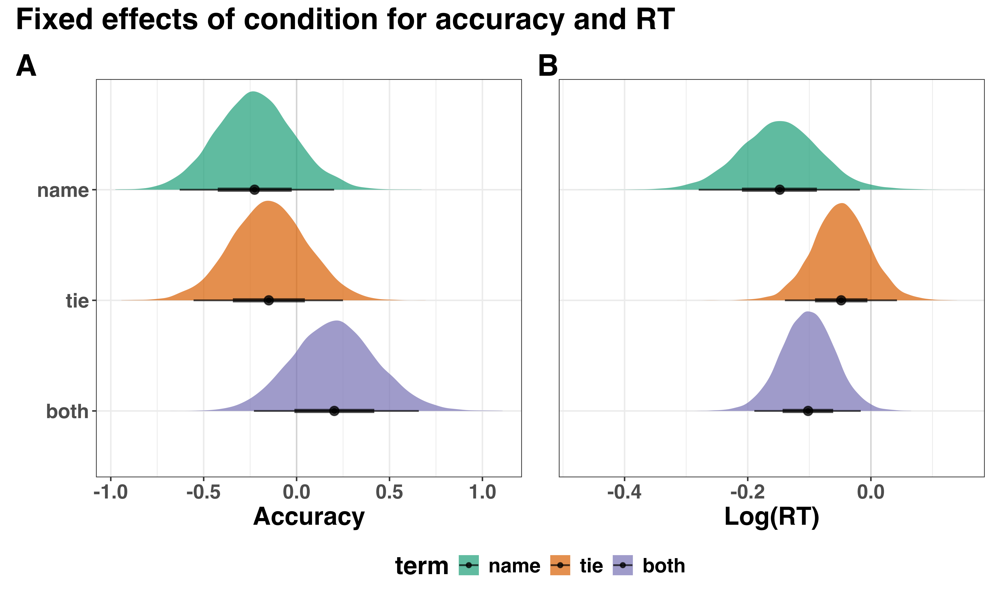

```{r setup, include = FALSE}
pkg <- c("papaja", "citr", "tidyverse", "RColorBrewer", "patchwork")

lapply(pkg, library, character.only = TRUE)
```

```{r analysis-preferences}
# Seed for random number generation
set.seed(42)
knitr::opts_chunk$set(cache.extra = knitr::rand_seed)
```

```{r plot-settings}
## theme settings for ggplot
theme_set(
  theme_bw() +
    theme(text = element_text(size = 18, face = "bold"), 
          title = element_text(size = 18, face = "bold"),
          legend.position = "bottom")
)

## Set the amount of dodge in figures
pd <- position_dodge(0.7)
pd2 <- position_dodge(1)
```

```{r global-chunk-settings}
## set the figure options
knitr::opts_chunk$set(fig.pos='H', out.extra = '', out.height = "67%",
                      fig.align = "center") # initial version
```

```{r papaja-terms-settings}
# supp_terms <- getOption("papaja.terms")
# supp_terms$table <- "Supplementary Table"
# supp_terms$figure <- "Supplementary Figure"
# options("papaja.terms" = supp_terms) 
```


# Supplementary Materials #

## Analysis of Observed Variables ##

In addition to our evidence accumulation modelling analysis, we first analysed accuracy and reaction time (RT). Analyses was conducted using a Bayesian estimation approach to multilevel modelling (McElreath, 2020). Specifically, we used the Bayesian modelling package “brms” to run multilevel models in the R (Bürkner, 2017).

Models were built incrementally towards the most complex model. This meant that all fixed and varying effects that the design would permit were included in the full model (Barr et al., 2013). Model 0 for both accuracy and reaction time were intercept only models so that we could compare all subsequent models that included effects of interest to a model without any predictors. The most complex model included an effect of training type (naming, tying, both, untrained). Shifted lognormal model was used to fit reaction time, while accuracy data was fit with a Bernoulli model. Priors were set using a weakly informative approach (see Supplementary Table 1 for all priors used for modelling) (Gelman, 2006). The formula for the full model (Model 1) used to fit reaction time data is specified below:

$$rt \sim 1 + training type + \\
(1 + training type | pid), \\
ndt \sim (1 | pid)$$

Note: RT = reaction time (ms); training type = training condition (untrained vs. naming vs. tying vs. both); pid = subject/participant identifier; ndt = non-decision time.

(ref:prior-table-caption) Priors used for models.

(ref:prior-table-note) dpar = distributional parameter; sd = standard deviation; b = fixed effect; cor = correlation; ndt = nondecision time.

```{r prior-table}
prior_acc_table <- tibble(
  Variable = c("Accuracy", NA, NA, NA),
  Prior = c("normal (0,1)", "normal (0,.5)", "normal (0,.5)", "Lkj(2)"),
  Class = c("Intercept", "sd", "b", "cor"),
  dpar = c(NA, "ndt", NA, NA)
)

prior_rt_table <- tibble(
  Variable = c("Reaction time", NA, NA, NA, NA, NA, NA),
  Prior = c("normal (6.68,0.5)", "normal (5.99,0.5)", 
            rep("normal (0,.5)", times =4),
            "Lkj(2)"),
  Class = c("Intercept", "Intercept", "b", "sd", "sd", "sigma", "cor"),
  dpar = c(NA, "ndt", NA, NA, "ndt", NA, NA)
)

prior_table <- bind_rows(prior_acc_table, prior_rt_table) %>% 
   mutate(across(everything(), ~replace_na(.x, "")))

apa_table(
  prior_table,
  caption = "(ref:prior-table-caption)",
  note = "(ref:prior-table-note)"
)
```

There was some evidence for relatively small effects of training type on accuracy (see Supplementary Figure 1A). The posterior distribution for the effect of each training type overlapped with zero, but did have values which fell mainly below or above zero. This suggests that relative to the untrained condition accuracy was lower in both the tying and naming conditions, but slighly higher in the combined condition.

There also appeared to be an effect of training type on RT (see Supplementary Figure 1B). Inspection of the posterior distribution for the fixed effects of training type revealed values which primarily fell below zero. This suggests that relative to knots that received no training, participants responded faster to knots that received naming, tying and both naming and tying training.
	
(ref:fixef-caption) Fixed Effects for the Most Complex Model for (A) Accuracy and (B) Reaction Time. Points represent the median value of the posterior distribution for that estimate, the thicker line represents 66th percentile, while the thinner line is the 95th percentile of the distribution. The untrained condition was the reference group.

```{r fixef-plot, fig.cap = "(ref:fixef-caption)"}

```

## LBA Analysis ##

### Sampling ###

For each model we used three times as many chains were used as model parameters. Sampling was carried out in two steps. First, sampling was carried out separately for individual participants in order to get reasonable start points for hierarchical sampling. The results of this step were then used as starting points for sampling the full hierarchical sample. During the initial burn-in-period there was a probability of .05 that a crossover step was replaced with a migration step. After burn in only crossover steps were used and sampling continued until the proportional scale reduction factor ($\hat{R}$) was less than 1.1 for all parameters, and also the multivariate version was less than 1.1 (Brooks & Gelman, 1998). Hierarchical estimation assumed independent normal population distributions for each model parameter. Population-mean start points were calculated from the mean of the individual-subject posterior medians and population standard deviation from their standard deviations, with each chain getting a slightly different random perturbation of these values. Hierarchical sampling used probability .05 migration steps at both levels of the hierarchy during burn in and only crossover steps thereafter with thinning set at 10 (i.e., only every 10th sample was kept), with sampling continuing until $\hat{R}$ for all parameters at all levels, and the multivariate $\hat{R}$ values, were all less than 1.1. The final set of chains were also inspected visually to confirm convergence.

### Priors ###

Priors were chosen to have little influence on estimation. Priors were normal distributions that were truncated below zero for B, A and sv parameters, and truncated at 0.1s for the t0 parameter (assuming that responses made in less than 0.1s are implausible). The t0 parameter was truncated above by 1s. There were no other truncations, so the v prior was unbounded. The prior mean for B was 1 and for A 0.5. The v parameter for the true accumulator was given a prior mean of 1, while the mismatching accumulator was given a prior mean of 0. The sv parameter for the matching accumulator had a prior mean of 0.5. The t0 parameter had a prior mean of 0.3s. All priors had a standard deviation of 2. Mean parameters of population distributions were assumed to have priors of the same form as for individual estimation, and the standard deviations of hyper parameters were assumed to have exponential distributions with a scale parameter of one. Plots of prior and posterior distributions revealed strong updating (i.e., posteriors dominated priors), making it clear that the prior assumptions had little influence on posterior estimates (see Supplementary Figure 2 for an example of how the priors were updated for hyperparameters).

(ref:prior-post-caption) Prior and Posterior Graphs. Red lines represent priors, while black lines represent posteriors. Only a selection of all the parameters are shown here.

```{r prior-post-plot, fig.cap = "(ref:prior-post-caption)"}
knitr::include_graphics("../../figures/ea/pp.pdf")
```

### Model fit ###

Supplementary Figures 3 display the fits of the LBA model to the data in terms of defective cumulative distribution functions (lines) and 10th, 30th, 50th, 70th and 90th percentiles (points from left to right) averaged over participants. Thick black lines and open points correspond to the data and the think grey lines solid black points to the model prediction averaged over posterior samples. The grey points correspond to percentile predictions for 100 randomly selected sets of posterior parameter samples, so their spread gives an idea of the uncertainty in the model’s predictions. As can be seen from the figure the average fit of the selected LBA model was reasonable.

(ref:model-fit-caption) Cumulative distribution functions for data (thick lines) and fits (line grey lines) of the LBA model. Each panel contains results for both same and different responses at each level of stimulus (match and mismatch) and training type (name, tie, both, untrained). Symbols mark the 10th, 30th, 50th, 70th and 90th percentile (solid for average fits, open for data). Grey points are 500 percentile estimates from fits for random draws from posterior samples; the grey line and black solid points are the average of these 500 fits.

```{r model-fit-plot, fig.cap = "(ref:model-fit-caption)"}
knitr::include_graphics("../../figures/ea/KN_fit.pdf")
```
